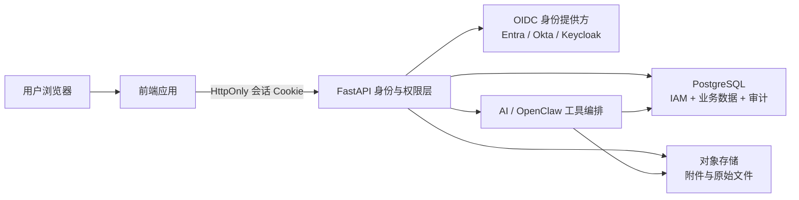

# AutoPolicy 账号与组织权限系统实施计划

## 1. 建设目标

账号系统不是单独增加一个登录页，而是为政策数据、企业项目、计算记录、AI 对话、附件与审计记录建立统一的身份和组织边界。

首期目标：

- 支持企业单点登录（OIDC）和受控的本地应急管理员；
- 支持一个用户加入一个或多个组织，并在组织间显式切换；
- 通过 RBAC 控制政策编辑、复核、计算、AI 工具、成员管理和审计读取；
- 将目前保存在进程内存中的 AI 对话迁入 PostgreSQL；
- 将附件迁移到对象存储，数据库只保存元数据、摘要和访问控制信息；
- 所有高价值操作均可追溯到用户、组织、时间、来源 IP、请求和业务对象；
- 本地测试、Docker 和服务器部署使用同一套迁移与配置结构。

## 2. 当前差距

| 领域 | 当前状态 | 风险 |
|---|---|---|
| 身份认证 | 无正式账号、会话和 OIDC | 无法确认操作者身份 |
| 组织隔离 | 无 `organization_id` | 企业项目和对话无法隔离 |
| 权限控制 | 无统一 RBAC | 前端隐藏按钮不能代替后端鉴权 |
| AI 对话 | `_conversations` 进程内存存储 | 重启丢失且无法归属用户 |
| 附件 | 本地会话目录 | 多实例部署、备份和权限控制困难 |
| 审计 | 缺少统一安全审计 | 无法解释谁查看或修改了什么 |
| 数据迁移 | SQL 脚本为主，缺少迁移登记表 | 多环境版本可能漂移 |

## 3. 推荐总体架构

关键原则：

1. 后端根据会话确定 `current_user`、`current_org` 和有效权限，不能接受前端传入的用户身份作为可信事实。
2. 默认拒绝；没有明确授权的接口和业务对象不能访问。
3. 公共政策、税则和证据可跨组织共享；企业项目、BOM、计算、对话和附件必须按组织隔离。
4. 优先使用服务器会话，不在浏览器长期保存高权限 JWT。

## 4. 数据模型

### 4.1 IAM 核心表

- `iam.user_account`：用户、OIDC subject、状态、最后登录时间；
- `iam.organization`：组织、显示名称、状态；
- `iam.organization_membership`：用户与组织关系；
- `iam.role`、`iam.permission`、`iam.role_permission`；
- `iam.membership_role`：组织成员拥有的角色；
- `iam.session`：只保存随机会话令牌的哈希、有效期、撤销时间和设备摘要；
- `iam.invitation`：邀请、有效期和接受状态；
- `iam.mfa_factor`：仅在启用本地高权限账号时使用。

### 4.2 AI 持久化表

- `assistant.conversation`：`organization_id`、`owner_user_id`、标题、状态；
- `assistant.message`：角色、内容、模型、序号、创建时间；
- `assistant.attachment`：对象存储键、MIME、哈希、解析状态、所属组织；
- `assistant.tool_run`：工具、输入摘要、输出摘要、状态、耗时、错误；
- `assistant.stream_run`：请求、开始/完成/中断状态、token 与事件统计。

### 4.3 业务对象补充字段

企业项目、BOM、企业输入、计算任务和保存的方案增加：

- `organization_id`；
- `created_by`、`updated_by`；
- `created_at`、`updated_at`；
- 必要时增加 `visibility` 和 `version`。

## 5. 角色与权限

首期预置角色：

| 角色 | 主要权限 |
|---|---|
| `system_admin` | 平台配置、组织管理、全局审计；不默认读取企业附件正文 |
| `org_admin` | 本组织成员、角色、项目和配额管理 |
| `policy_editor` | 新建和编辑政策、税则与证据草稿 |
| `policy_reviewer` | 复核、发布、退回和标记失效 |
| `analyst` | 运行 CBU/CKD 计算、AI 分析、保存方案 |
| `project_manager` | 管理本组织项目、BOM 和计算输入 |
| `viewer` | 只读查看允许范围内的数据与结果 |
| `audit_reader` | 只读审计、证据链和访问记录 |

权限按动作拆分，例如：

- `policy.read/create/update/review/publish`；
- `evidence.read/create/verify`；
- `calculation.run/read/export`；
- `project.read/create/update/archive`；
- `bom.read/update`；
- `assistant.chat/upload/web_search`；
- `conversation.read_own/read_org/archive`；
- `member.manage`、`role.manage`、`audit.read`。

## 6. 分阶段实施

### 阶段 A：身份与数据库基线

- 建立 `platform.schema_migration`，记录版本、校验和和执行时间；
- 新增 `0011_iam_core.sql`；
- 接入 OIDC 登录、回调、退出和 `GET /api/v1/auth/me`；
- 使用 `Secure + HttpOnly + SameSite=Lax` 会话 Cookie；
- 建立本地开发身份提供方配置，生产密钥仅从服务器 Secret Manager 注入。

验收：匿名请求不能访问私有接口；登录、退出、过期和撤销会话均可测试。

### 阶段 B：组织与 RBAC

- 增加组织切换、成员邀请和角色分配；
- FastAPI 增加统一 `require_permission()` 依赖；
- 所有私有 API 从后端上下文读取组织，不信任请求体的组织 ID；
- 前端根据权限改善交互，但后端仍独立强制鉴权。

验收：完成跨组织越权、IDOR、无权限写入和管理员降权测试。

### 阶段 C：AI 对话、附件和流任务持久化

- 新增 `0012_assistant_persistence.sql`；
- 将内存对话改为 PostgreSQL；
- 将附件改为 S3 兼容对象存储（本地可用 MinIO）；
- SSE 运行关联 `conversation_id`、`user_id`、`organization_id` 和 `request_id`；
- 支持重新连接后读取已完成消息，中断任务记录为 `CANCELLED` 或 `FAILED`。

验收：后端重启后历史对话仍存在；用户无法读取其他组织对话或附件。

### 阶段 D：企业业务数据归属

- 新增 `0013_organization_ownership.sql`；
- 企业项目、BOM、企业参数、计算运行和保存方案增加组织归属；
- 公开政策库继续共享，企业数据默认私有；
- 为将来的行级安全（PostgreSQL RLS）预留会话变量与策略。

验收：同一计算规则可被多个组织使用，但企业输入和结果互不可见。

### 阶段 E：审计、安全和上线

- 记录登录失败、权限变化、政策发布、导出、附件读取、AI 工具调用和联网搜索；
- 对登录、上传、搜索和模型调用分别限流；
- 增加 CSRF、CORS、恶意文件、路径穿越、提示注入、会话重放与密钥泄漏测试；
- 完成备份恢复、迁移回滚、会话密钥轮换和灾难恢复演练。

验收：生产安全清单通过，恢复演练能在目标 RPO/RTO 内恢复账号、项目和对话元数据。

## 7. 迁移策略

1. 新字段先允许为空，不立即破坏现有数据；
2. 根据现有 `enterprise_code` 建立初始组织并回填可识别的数据；
3. 无法确定归属的旧对话标记为 `LEGACY_ORPHANED`，只允许系统管理员迁移，不自动暴露；
4. 对话先双写内存和数据库，验证稳定后切换为数据库单写；
5. 完成数据核对后再增加 `NOT NULL`、外键和唯一约束；
6. 每个迁移脚本必须可重复检测、可备份、可回滚，并在 CI 中从空库完整执行。

## 8. 建议 API

- `GET /api/v1/auth/oidc/start`
- `GET /api/v1/auth/oidc/callback`
- `GET /api/v1/auth/me`
- `POST /api/v1/auth/logout`
- `POST /api/v1/auth/revoke-all`
- `GET /api/v1/organizations`
- `POST /api/v1/organizations/{id}/switch`
- `GET/POST /api/v1/organizations/{id}/members`
- `PATCH /api/v1/organizations/{id}/members/{membership_id}`
- `GET /api/v1/me/permissions`
- `GET/POST /api/v1/assistant/conversations`
- `GET /api/v1/assistant/conversations/{id}/messages`
- `POST /api/v1/assistant/runs/{id}/cancel`

## 9. 推荐执行顺序

流式输出验收完成后，立即实施阶段 A 和 B；账号与组织边界稳定后再迁移 AI 对话和附件。不要先做复杂的个人资料页、社交登录或收费套餐，这些对当前企业政策决策系统的核心安全价值较低。

